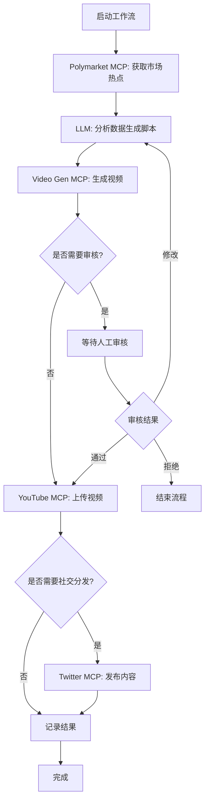

# fastKOL 项目技术开发企划书

**Web3 自动化内容生成与分发系统**

*完整技术架构与实施文档*

Version 1.0  
2026-01-28

---

## 目录

1. [项目概述](#1-项目概述)
2. [技术架构](#2-技术架构)
3. [工作流程设计](#3-工作流程设计)
4. [核心组件实现](#4-核心组件实现)
5. [环境配置与部署](#5-环境配置与部署)
6. [MCP Server 配置详解](#6-mcp-server-配置详解)
7. [关键实现细节](#7-关键实现细节)
8. [监控与维护](#8-监控与维护)
9. [常见问题与解决方案](#9-常见问题与解决方案)
10. [未来规划](#10-未来规划)

---

## 1. 项目概述

### 1.1 项目背景

在 Web3 生态系统中,市场热点瞬息万变,KOL(Key Opinion Leader)需要快速捕捉热点并生成高质量内容进行传播。fastKOL 项目旨在通过 AI 自动化技术,帮助 Web3 从业者:

- ✅ 实时监控 Polymarket 预测市场的热点话题和趋势
- ✅ 自动生成专业的视频脚本和内容
- ✅ 通过 AI 视频生成技术创建高质量的短视频
- ✅ 自动化上传视频到 YouTube，并可分发到 Twitter/X 等社交平台
- ✅ 提供可视化的工作流管理界面

> 当前阶段仅实现后端流程与接口编排,前端与可视化管理界面暂不在本次重构范围内。

### 1.2 核心价值

- **降低内容创作门槛**: 无需专业视频制作技能
- **提升响应速度**: 从热点捕捉到内容发布仅需几分钟
- **完全自动化**: 减少人工干预,提高效率
- **专注 Web3**: 深度结合加密货币和区块链领域特点

### 1.3 应用场景

- **Web3 项目方**: 快速响应市场动态,发布项目相关内容
- **加密货币交易员**: 分享市场分析和交易见解
- **区块链媒体**: 自动化新闻和热点报道
- **Web3 KOL**: 批量生成和发布优质内容
- **社区管理者**: 及时传播社区重要信息

---

## 2. 技术架构

### 2.1 架构概览

fastKOL 采用现代化的微服务架构,基于 **SpoonOS Agent** 框架构建,通过 **MCP(Model Context Protocol)** 协议整合多个免费的 AI 服务。系统分为四个主要层次:

- **前端展示层**: React + Vite 构建的交互界面
- **Agent 编排层**: SpoonOS React Agent 核心逻辑
- **MCP 服务层**: 集成各类外部服务
- **数据持久层**: 工作流状态和结果存储

### 2.2 核心技术栈

| 技术分类 | 技术选型 |
|---------|---------|
| 前端框架 | React 18 + Vite 5 + TypeScript |
| Agent 框架 | SpoonOS (SpoonReact Agent + Skills) |
| AI 模型 | OpenRouter (默认) / OpenAI / Anthropic / Gemini |
| 视频生成 | Google Veo 2 MCP / InVideo AI MCP |
| 市场数据 | Polymarket MCP Server |
| 视频上传 | YouTube MCP Server (优先) / Twitter/X MCP Server |
| 社交分发 | YouTube + Twitter/X |
| 容器化 | Docker + Docker Compose |
| 编程语言 | Python 3.11+ (后端) + TypeScript (前端) |

### 2.3 系统架构图

```
┌─────────────────────────────────────────────┐
│              前端展示层                        │
│   React + Vite + TypeScript + TailwindCSS   │
│   - 工作流配置界面                             │
│   - 实时状态监控                              │
│   - 结果预览与管理                             │
└─────────────────────────────────────────────┘
                    ↓ HTTP/WebSocket
┌─────────────────────────────────────────────┐
│           SpoonOS Agent 层                   │
│        (SpoonReactMCP + Skills)             │
│   - 工作流编排引擎                             │
│   - 任务调度与监控                             │
│   - 错误处理与重试                             │
│   - 状态管理                                  │
└─────────────────────────────────────────────┘
                    ↓ MCP Protocol
┌─────────────────────────────────────────────┐
│              MCP 服务层                       │
├───────────┬───────────┬───────────┬─────────┤
│Polymarket │ Video Gen │ YouTube   │ Twitter │
│MCP Server │MCP Server │MCP Server │ MCP     │
│- 市场数据  │- 脚本生成  │- 视频上传  │- 媒体上传 │
│- 趋势分析  │- 视频生成  │- 元数据    │- 推文发布 │
└───────────┴───────────┴───────────┴─────────┘
                    ↓
┌─────────────────────────────────────────────┐
│            外部 API 层                        │
│ Polymarket API | Google Veo 2 | Twitter API │
└─────────────────────────────────────────────┘
```

---

## 3. 工作流程设计

### 3.1 完整工作流

fastKOL 的核心工作流分为五个主要阶段,每个阶段都可以独立监控和管理:

```
阶段1: 热点采集 → 阶段2: 内容策划 → 阶段3: 视频制作 
    ↓
阶段4: 内容审核(可选) → 阶段5: 社交分发
```

### 3.2 详细流程说明

#### 阶段 1: 热点采集

系统通过 Polymarket MCP Server 获取实时市场数据,筛选出与 Web3 相关的热门话题。筛选标准包括交易量、流动性、话题分类等指标。

```python
# 调用 Polymarket MCP
markets = await polymarket.list_markets(
    status="open",
    limit=20,
    category="crypto"
)

# 筛选热点
top_markets = sorted(
    markets, 
    key=lambda x: x["volume"], 
    reverse=True
)[:3]
```

#### 阶段 2: 内容策划

LLM 先生成 Polymarket 报告摘要,再将报告内容转换为**视频口播脚本**(数字人口播稿)。脚本包含:

- **title**: 吸引人的标题
- **hook**: 3秒内抓住注意力的开场
- **body**: 30-45秒的主要内容
- **cta**: 明确的行动号召
- **keyframes**: 3-4个关键视觉场景描述
- **hashtags**: 相关话题标签

#### 阶段 3: 视频制作

使用 Google Veo 2 / InVideo 等视频生成 MCP 服务,根据**口播脚本**和关键帧描述生成数字人口播视频。视频参数:
- 格式: 9:16 竖屏
- 分辨率: 1080p
- 时长: 30-60 秒
- 形象: 女主播, 正对镜头口播

#### 阶段 4: 内容审核(可选)

如启用审核功能,系统会暂停并等待人工审核。审核员可以:
- 预览视频和脚本
- 选择批准、拒绝或修改
- 审核完成后工作流自动继续

#### 阶段 5: 社交分发 / 视频上传

YouTube MCP Server 优先负责:
- 上传视频
- 填写标题/描述/标签
- 返回视频 URL

Twitter/X MCP Server 作为备选:
- 发布推文
- 添加话题标签
- 记录推文 URL 和统计数据

> 后端实现优先使用 YouTube MCP，无法连接时可回退到 Twitter/X MCP 或跳过。

### 3.3 流程图



---

## 4. 核心组件实现

### 4.1 SpoonOS Agent 配置

Agent 是整个系统的核心编排器,负责协调各个 MCP 服务完成完整的工作流。

```python
from spoon_ai.agents import SpoonReactMCP
from spoon_ai.tools.mcp_tool import MCPTool
from spoon_ai.tools import ToolManager
from spoon_ai.chat import ChatBot
import os

class FastKOLAgent(SpoonReactMCP):
    """fastKOL 主 Agent"""
    
    def __init__(self, **kwargs):
        super().__init__(**kwargs)
        
        # 配置 LLM
        self.llm = ChatBot(
            model_name="gpt-4-turbo",
            temperature=0.7,
            max_tokens=4096
        )
        
        # 初始化 MCP 工具
        self.available_tools = self._setup_mcp_tools()
        
        # 设置系统提示词
        self.system_prompt = self._get_system_prompt()
        
        # 执行参数
        self.max_steps = 25
        self.verbose = True
    
    def _setup_mcp_tools(self) -> ToolManager:
        """配置所有 MCP 工具"""
        tools = []
        
        # 1. Polymarket 工具
        if os.getenv("POLYMARKET_API_KEY"):
            polymarket_tool = MCPTool(
                name="polymarket",
                description="获取预测市场数据和热点话题",
                mcp_config={
                    "command": "uv",
                    "args": [
                        "--directory", 
                        "./polymarket-mcp",
                        "run", 
                        "src/polymarket_mcp/server.py"
                    ],
                    "env": {
                        "KEY": os.getenv("POLYMARKET_API_KEY"),
                        "FUNDER": os.getenv("POLYMARKET_WALLET")
                    },
                    "transport": "stdio",
                    "timeout": 30
                }
            )
            tools.append(polymarket_tool)
        
        # 2. 视频生成工具
        if os.getenv("GOOGLE_API_KEY"):
            video_tool = MCPTool(
                name="veo2_video",
                description="使用 Google Veo 2 生成视频",
                mcp_config={
                    "command": "npx",
                    "args": ["-y", "@mario-andreschak/mcp-veo2"],
                    "env": {
                        "GEMINI_API_KEY": os.getenv("GOOGLE_API_KEY")
                    },
                    "transport": "stdio",
                    "timeout": 300  # 视频生成需要更长时间
                }
            )
            tools.append(video_tool)
        
        # 3. YouTube MCP (优先上传视频)
        if os.getenv("MCP_YOUTUBE_URL"):
            youtube_tool = MCPTool(
                name="youtube",
                description="上传视频到 YouTube",
                mcp_config={
                    "command": "npx",
                    "args": ["mcp-remote", os.getenv("MCP_YOUTUBE_URL")],
                    "transport": "http",
                    "timeout": 120
                }
            )
            tools.append(youtube_tool)

        # 4. Twitter/X 工具 (备选)
        if os.getenv("TWITTER_API_KEY"):
            twitter_tool = MCPTool(
                name="twitter",
                description="发布推文和上传媒体",
                mcp_config={
                    "command": "npx",
                    "args": ["-y", "@enescinar/twitter-mcp"],
                    "env": {
                        "API_KEY": os.getenv("TWITTER_API_KEY"),
                        "API_SECRET_KEY": os.getenv("TWITTER_API_SECRET"),
                        "ACCESS_TOKEN": os.getenv("TWITTER_ACCESS_TOKEN"),
                        "ACCESS_TOKEN_SECRET": os.getenv("TWITTER_ACCESS_SECRET")
                    },
                    "transport": "stdio",
                    "timeout": 60
                }
            )
            tools.append(twitter_tool)
        
        return ToolManager(tools)
    
    def _get_system_prompt(self) -> str:
        """获取系统提示词"""
        return """
你是 fastKOL,一个专业的 Web3 内容自动化助手。你的任务是:

1. 监控 Polymarket 预测市场,识别热点话题
2. 分析市场数据,生成吸引人的视频脚本
3. 使用 AI 视频生成工具创建短视频
4. 优先上传到 YouTube,必要时分发到 Twitter/X

工作流程:
- 使用 polymarket 工具获取热门市场数据
- 分析数据并生成视频脚本(包括标题、内容、关键帧描述)
- 使用 veo2_video 工具生成视频
- 使用 youtube 工具上传视频
- 使用 twitter 工具分发内容(可选)

脚本要求:
- 标题要吸引眼球,突出 Web3/Crypto 关键词
- 开场3秒内抓住注意力
- 主体内容30-45秒,清晰传达核心信息
- 包含明确的 CTA(关注、评论、转发)
- 添加3-5个相关话题标签
- 口播角色为女性,正对镜头

始终保持专业、准确、及时的内容输出。
"""

    async def run_workflow(self, config: dict) -> dict:
        """执行完整工作流"""
        result = {
            "status": "started",
            "stages": {}
        }
        
        try:
            # 阶段1: 获取市场热点
            result["stages"]["market_data"] = await self._fetch_markets(config)
            
            # 阶段2: 生成脚本
            result["stages"]["script"] = await self._generate_script(
                result["stages"]["market_data"]
            )
            
            # 阶段3: 生成视频
            result["stages"]["video"] = await self._generate_video(
                result["stages"]["script"]
            )
            
            # 阶段4: 审核(如果启用)
            if config.get("enable_review", False):
                result["stages"]["review"] = await self._wait_for_review(
                    result["stages"]["video"],
                    result["stages"]["script"]
                )
                if not result["stages"]["review"]["approved"]:
                    result["status"] = "rejected"
                    return result
            
            # 阶段5: 发布到 Twitter
            result["stages"]["publish"] = await self._publish_to_twitter(
                result["stages"]["video"],
                result["stages"]["script"]
            )
            
            result["status"] = "completed"
            
        except Exception as e:
            result["status"] = "failed"
            result["error"] = str(e)
        
        return result
```

### 4.2 前端实现要点

前端使用 React + Vite 构建,提供实时的工作流监控和管理界面。

#### 项目结构

```
frontend/
├── src/
│   ├── components/
│   │   ├── Dashboard.tsx          # 主仪表板
│   │   ├── WorkflowStatus.tsx     # 工作流状态
│   │   ├── MarketCard.tsx         # 市场热点卡片
│   │   ├── VideoPreview.tsx       # 视频预览
│   │   └── TweetPreview.tsx       # 推文预览
│   ├── hooks/
│   │   ├── useWorkflow.ts         # 工作流状态管理
│   │   └── useWebSocket.ts        # WebSocket 连接
│   ├── services/
│   │   └── api.ts                 # API 调用
│   ├── App.tsx
│   └── main.tsx
├── package.json
└── vite.config.ts
```

#### 关键组件示例

```typescript
// WorkflowStatus.tsx
import React, { useState, useEffect } from 'react';
import { useWebSocket } from '../hooks/useWebSocket';

interface Stage {
  name: string;
  status: 'pending' | 'running' | 'completed' | 'failed';
  data?: any;
  error?: string;
}

export const WorkflowStatus: React.FC = () => {
  const [stages, setStages] = useState<Stage[]>([
    { name: '热点采集', status: 'pending' },
    { name: '内容策划', status: 'pending' },
    { name: '视频制作', status: 'pending' },
    { name: '内容审核', status: 'pending' },
    { name: '社交分发', status: 'pending' },
  ]);

  const { lastMessage } = useWebSocket('ws://localhost:8000/ws');

  useEffect(() => {
    if (lastMessage) {
      const update = JSON.parse(lastMessage.data);
      setStages(prevStages =>
        prevStages.map(stage =>
          stage.name === update.stage
            ? { ...stage, ...update }
            : stage
        )
      );
    }
  }, [lastMessage]);

  return (
    <div className="workflow-status">
      {stages.map((stage, index) => (
        <div key={index} className={`stage stage-${stage.status}`}>
          <div className="stage-icon">
            {stage.status === 'completed' && '✓'}
            {stage.status === 'running' && '⟳'}
            {stage.status === 'failed' && '✗'}
            {stage.status === 'pending' && '○'}
          </div>
          <div className="stage-info">
            <h3>{stage.name}</h3>
            <p>{stage.status}</p>
            {stage.error && <p className="error">{stage.error}</p>}
          </div>
        </div>
      ))}
    </div>
  );
};
```

---

## 5. 环境配置与部署

### 5.1 系统要求

- **操作系统**: Linux (Ubuntu 22.04+) / macOS / Windows (WSL2)
- **Python**: 3.11 或更高版本
- **Node.js**: 18+ 和 npm
- **Docker**: 最新稳定版
- **Docker Compose**: v2.0+
- **硬件**: 至少 8GB RAM 和 20GB 可用磁盘空间

### 5.2 安装 SpoonOS

```bash
# 1. 克隆 SpoonOS 核心仓库
git clone https://github.com/XSpoonAi/spoon-core.git
cd spoon-core

# 2. 创建虚拟环境
python -m venv spoon-env
source spoon-env/bin/activate  # Linux/macOS
# Windows: spoon-env\Scripts\activate

# 3. 安装 uv (推荐的包管理器)
pip install uv

# 4. 安装依赖
uv pip install -r requirements.txt

# 5. 可编辑模式安装
uv pip install -e .
```

### 5.3 环境变量配置

创建 `.env` 文件:

```bash
# === LLM Provider ===
OPENAI_API_KEY=sk-...
ANTHROPIC_API_KEY=sk-ant-...
GEMINI_API_KEY=...

# === Polymarket ===
POLYMARKET_API_KEY=your_polymarket_api_key
POLYMARKET_WALLET=0xYourWalletAddress

# === Google Veo 2 (视频生成) ===
GOOGLE_API_KEY=your_google_api_key

# === Twitter/X API ===
TWITTER_API_KEY=your_twitter_api_key
TWITTER_API_SECRET=your_twitter_api_secret
TWITTER_ACCESS_TOKEN=your_access_token
TWITTER_ACCESS_SECRET=your_access_token_secret

# === 应用配置 ===
APP_PORT=8000
APP_HOST=0.0.0.0
LOG_LEVEL=INFO
WORKFLOW_TIMEOUT=600

# === 数据库 ===
DATABASE_URL=sqlite:///./fastKOL.db

# === Redis (可选,用于任务队列) ===
REDIS_URL=redis://localhost:6379/0
```

### 5.4 Docker 部署

#### Dockerfile

```dockerfile
# backend/Dockerfile
FROM python:3.11-slim

WORKDIR /app

# 安装系统依赖
RUN apt-get update && apt-get install -y \
    git \
    curl \
    && rm -rf /var/lib/apt/lists/*

# 安装 uv
RUN pip install uv

# 复制依赖文件
COPY requirements.txt .
RUN uv pip install -r requirements.txt

# 复制应用代码
COPY . .

# 安装 SpoonOS
RUN uv pip install -e .

# 暴露端口
EXPOSE 8000

# 启动命令
CMD ["python", "main.py"]
```

#### docker-compose.yml

```yaml
version: '3.8'

services:
  backend:
    build: ./backend
    ports:
      - "8000:8000"
    env_file:
      - .env
    volumes:
      - ./data:/app/data
      - ./logs:/app/logs
    depends_on:
      - redis
    restart: unless-stopped

  frontend:
    build: ./frontend
    ports:
      - "3000:3000"
    environment:
      - VITE_API_URL=http://localhost:8000
    depends_on:
      - backend
    restart: unless-stopped

  redis:
    image: redis:7-alpine
    ports:
      - "6379:6379"
    volumes:
      - redis_data:/data
    restart: unless-stopped

volumes:
  redis_data:
```

#### 部署命令

```bash
# 1. 克隆项目
git clone https://github.com/yourusername/fastKOL.git
cd fastKOL

# 2. 配置环境变量
cp .env.example .env
# 编辑 .env 文件,填入你的 API 密钥

# 3. 构建并启动容器
docker-compose up -d --build

# 4. 查看日志
docker-compose logs -f

# 5. 停止服务
docker-compose down
```

---

## 6. MCP Server 配置详解

### 6.1 Polymarket MCP Server

提供预测市场数据访问能力。

#### 安装

```bash
# 克隆仓库
git clone https://github.com/berlinbra/polymarket-mcp.git
cd polymarket-mcp

# 安装依赖
uv pip install -e .
```

#### 配置

```json
{
  "mcpServers": {
    "polymarket": {
      "command": "uv",
      "args": [
        "--directory",
        "/path/to/polymarket-mcp",
        "run",
        "src/polymarket_mcp/server.py"
      ],
      "env": {
        "KEY": "your_api_key_here",
        "FUNDER": "0xYourWalletAddress"
      }
    }
  }
}
```

#### 可用工具

1. **list_markets**: 列出市场
   - 参数: status, limit, offset
   - 返回: 市场列表(ID、标题、状态、交易量等)

2. **get_market_details**: 获取市场详情
   - 参数: market_id
   - 返回: 完整市场信息

3. **get_market_prices**: 获取当前价格
   - 参数: market_id
   - 返回: 结果价格和概率

4. **get_market_history**: 获取历史数据
   - 参数: market_id, timeframe
   - 返回: 时间序列数据

### 6.2 Google Veo 2 视频生成

Google 最新的视频生成模型。

#### 安装

```bash
npm install -g @mario-andreschak/mcp-veo2
```

#### 配置

```json
{
  "mcpServers": {
    "veo2": {
      "command": "npx",
      "args": ["-y", "@mario-andreschak/mcp-veo2"],
      "env": {
        "GEMINI_API_KEY": "your_google_api_key"
      }
    }
  }
}
```

#### 重要限制

- **视频时长**: 5-8 秒 (API 限制,模型支持更长)
- **分辨率**: 720p (API),模型支持 4K
- **生成时间**: 约 2-5 分钟
- **费用**: 约 $0.35/秒视频

#### 使用示例

```python
# 生成视频
video_result = await veo2_tool.execute(
    prompt="A serene crypto trading floor with holographic charts",
    config={
        "aspectRatio": "9:16",
        "personGeneration": "dont_allow"
    }
)
```

### 6.3 InVideo AI MCP (备选方案)

完全免费的视频生成服务。

#### 特点

- ✅ 完全免费
- ✅ 自动脚本生成
- ✅ 16M+ 素材库
- ✅ AI 配音
- ✅ 50+ 语言字幕

#### 连接方式

推荐使用官方远程 MCP Server（本项目默认选择官方 MCP）。

**方案 A: 官方远程 MCP（默认）**

```text
https://mcp.invideo.io/sse
```

**方案 B: MCP Bundles 远程 MCP**

```text
https://mcp.mcpbundles.com/bundle/invideo
```

#### 配置示例 (远程 MCP)

```json
{
  "mcpServers": {
    "invideo": {
      "command": "npx",
      "args": ["mcp-remote", "https://mcp.invideo.io/sse"]
    }
  }
}
```

### 6.4 YouTube MCP Server

#### 本地 MCP (推荐)

使用本地 FastMCP Server 进行视频上传:

```bash
python -m src.mcp.youtube_server
```

默认地址:

```text
http://127.0.0.1:7020
```

#### MCP 配置示例

```json
{
  "mcpServers": {
    "youtube": {
      "command": "npx",
      "args": ["mcp-remote", "http://127.0.0.1:7020"]
    }
  }
}
```

#### 必要配置

需要 OAuth 2.0 凭据(建议使用刷新令牌):

- `YOUTUBE_CLIENT_ID`
- `YOUTUBE_CLIENT_SECRET`
- `YOUTUBE_REFRESH_TOKEN`

可选配置:

- `YOUTUBE_UPLOAD_CATEGORY_ID` (默认 22)
- `YOUTUBE_UPLOAD_PRIVACY` (public / unlisted / private)
- `YOUTUBE_UPLOAD_MADE_FOR_KIDS` (true / false)
- `YOUTUBE_THUMBNAIL_PATH` (可选封面图路径)

#### 提供的 MCP 工具

- `youtube_upload_video(file_path, title, description, tags, category_id, privacy_status, made_for_kids, content_type)`
- `youtube_update_video_metadata(video_id, title, description, tags, category_id, privacy_status, made_for_kids, contains_synthetic_media)`
- `youtube_get_video_status(video_id, parts)`
- `youtube_set_thumbnail(video_id, image_path, content_type)`

---

### 6.5 Twitter/X MCP Server

#### 本地 MCP (推荐)

由于 X/Twitter 暂无官方远程 MCP，这里提供一个基于 FastMCP 的本地 MCP Server：

```bash
python -m src.mcp.x_twitter_server
```

默认地址：

```text
http://127.0.0.1:7010
```

#### MCP 配置示例

```json
{
  "mcpServers": {
    "twitter": {
      "command": "npx",
      "args": ["mcp-remote", "http://127.0.0.1:7010"]
    }
  }
}
```

#### 获取 API 密钥

1. 访问 [Twitter Developer Portal](https://developer.twitter.com/)
2. 创建新应用
3. 生成 API Keys 和 Access Tokens
4. 确保应用有读写权限

#### 限制

- 免费版 API 有速率限制
- 视频上传最大 512MB
- 支持格式: MP4, MOV
- 推文文本最多 280 字符

---

## 7. 关键实现细节

### 7.0 后端主入口

后端主入口使用 **ReactAgent** 作为默认执行模式,以便通过 Tools 与 Skills 灵活编排任务链路。

### 7.1 错误处理与重试

```python
import asyncio
from functools import wraps

def retry_on_error(max_retries=3, delay=1):
    """重试装饰器"""
    def decorator(func):
        @wraps(func)
        async def wrapper(*args, **kwargs):
            for attempt in range(max_retries):
                try:
                    return await func(*args, **kwargs)
                except Exception as e:
                    if attempt == max_retries - 1:
                        raise
                    wait_time = delay * (2 ** attempt)  # 指数退避
                    print(f"尝试 {attempt + 1} 失败: {e}, {wait_time}秒后重试")
                    await asyncio.sleep(wait_time)
        return wrapper
    return decorator

# 使用示例
@retry_on_error(max_retries=3, delay=2)
async def fetch_market_data(market_id: str):
    """获取市场数据,自动重试"""
    return await polymarket_tool.execute(
        action="get_market_details",
        market_id=market_id
    )
```

### 7.2 性能优化

| 优化项 | 实施方案 |
|--------|---------|
| 并行处理 | 使用 `asyncio.gather()` 同时处理多个市场 |
| 缓存优化 | 缓存 Polymarket 数据 5 分钟,减少 API 调用 |
| 批量处理 | 积累多个视频后批量上传到 Twitter |
| 队列管理 | 使用 Redis 队列管理长时间任务 |
| 限流保护 | 实现 Token Bucket 算法控制 API 调用频率 |
| 资源池化 | 复用 HTTP 连接和 MCP Server 实例 |

#### 并行处理示例

```python
async def process_multiple_markets(market_ids: list):
    """并行处理多个市场"""
    tasks = [
        fetch_and_process_market(market_id)
        for market_id in market_ids
    ]
    results = await asyncio.gather(*tasks, return_exceptions=True)
    
    # 过滤错误
    successful_results = [
        r for r in results 
        if not isinstance(r, Exception)
    ]
    
    return successful_results
```

#### 缓存实现

```python
from functools import lru_cache
import time

class CachedMarketData:
    def __init__(self, ttl=300):  # 5分钟TTL
        self.cache = {}
        self.ttl = ttl
    
    async def get_market(self, market_id: str):
        now = time.time()
        
        if market_id in self.cache:
            data, timestamp = self.cache[market_id]
            if now - timestamp < self.ttl:
                return data
        
        # 缓存过期或不存在,重新获取
        data = await fetch_market_data(market_id)
        self.cache[market_id] = (data, now)
        return data
```

### 7.3 状态持久化

使用 SQLite 数据库持久化工作流状态:

```python
# models.py
from sqlalchemy import Column, Integer, String, DateTime, JSON
from sqlalchemy.ext.declarative import declarative_base
import datetime

Base = declarative_base()

class Workflow(Base):
    __tablename__ = 'workflows'
    
    id = Column(Integer, primary_key=True)
    status = Column(String)  # pending, running, completed, failed
    created_at = Column(DateTime, default=datetime.datetime.utcnow)
    updated_at = Column(DateTime, onupdate=datetime.datetime.utcnow)
    config = Column(JSON)
    result = Column(JSON)

class WorkflowEvent(Base):
    __tablename__ = 'workflow_events'
    
    id = Column(Integer, primary_key=True)
    workflow_id = Column(Integer)
    stage = Column(String)
    status = Column(String)
    data = Column(JSON)
    timestamp = Column(DateTime, default=datetime.datetime.utcnow)
```

---

## 8. 监控与维护

### 8.1 日志管理

```python
import logging
from logging.handlers import RotatingFileHandler

# 配置日志
def setup_logging():
    logger = logging.getLogger('fastKOL')
    logger.setLevel(logging.INFO)
    
    # 控制台处理器
    console_handler = logging.StreamHandler()
    console_handler.setLevel(logging.INFO)
    
    # 文件处理器(自动轮转)
    file_handler = RotatingFileHandler(
        'logs/fastKOL.log',
        maxBytes=10*1024*1024,  # 10MB
        backupCount=5
    )
    file_handler.setLevel(logging.DEBUG)
    
    # 格式化
    formatter = logging.Formatter(
        '%(asctime)s - %(name)s - %(levelname)s - %(message)s'
    )
    console_handler.setFormatter(formatter)
    file_handler.setFormatter(formatter)
    
    logger.addHandler(console_handler)
    logger.addHandler(file_handler)
    
    return logger
```

### 8.2 指标收集

```python
from prometheus_client import Counter, Histogram, Gauge

# 定义指标
workflow_started = Counter('workflow_started_total', 'Total workflows started')
workflow_completed = Counter('workflow_completed_total', 'Total workflows completed')
workflow_failed = Counter('workflow_failed_total', 'Total workflows failed')

stage_duration = Histogram(
    'stage_duration_seconds',
    'Stage execution duration',
    ['stage_name']
)

active_workflows = Gauge('active_workflows', 'Number of active workflows')

# 使用指标
@stage_duration.labels(stage_name='market_data').time()
async def fetch_markets():
    workflow_started.inc()
    active_workflows.inc()
    try:
        # 执行任务
        result = await get_market_data()
        workflow_completed.inc()
        return result
    except Exception as e:
        workflow_failed.inc()
        raise
    finally:
        active_workflows.dec()
```

### 8.3 告警配置

推荐配置以下告警规则:

- ⚠️ API 失败率超过 10%
- ⚠️ 平均执行时间超过 10 分钟
- ⚠️ 磁盘空间低于 20%
- ⚠️ 内存使用超过 80%
- ⚠️ 连续 3 次工作流失败

---

## 9. 常见问题与解决方案

| 问题 | 原因 | 解决方案 |
|------|------|---------|
| MCP Server 无法连接 | npm 包未安装或 API 密钥错误 | 检查 npm 安装和环境变量配置 |
| 视频生成失败 | Google API 配额不足或账单问题 | 检查 Google Cloud 账单和配额 |
| Twitter 发布失败 | API 权限不足或速率限制 | 升级 Twitter API 套餐或降低发布频率 |
| 工作流超时 | 网络延迟或 API 响应慢 | 增加 `WORKFLOW_TIMEOUT` 配置 |
| 前端无法连接后端 | 端口被占用或防火墙阻止 | 检查端口配置和防火墙规则 |

### 调试技巧

```bash
# 查看 Docker 日志
docker-compose logs -f backend

# 进入容器调试
docker-compose exec backend bash

# 测试 MCP 连接
npx @modelcontextprotocol/inspector \
  uv --directory /path/to/polymarket-mcp \
  run src/polymarket_mcp/server.py

# 查看数据库
sqlite3 fastKOL.db
```

---

## 10. 未来规划

### 10.1 短期目标 (1-3 个月)

- [ ] 支持更多视频生成服务 (Runway, Pika)
- [ ] 添加多语言内容生成能力
- [ ] 实现智能发布时间优化
- [ ] 增加内容 A/B 测试功能
- [ ] 优化视频生成质量和速度

### 10.2 中期目标 (3-6 个月)

- [ ] 支持多平台分发 (YouTube, TikTok, Instagram)
- [ ] 添加内容效果分析和优化建议
- [ ] 实现用户画像和个性化内容
- [ ] 开发移动端应用
- [ ] 集成更多 Web3 数据源

### 10.3 长期愿景

fastKOL 的长期目标是成为 **Web3 领域最智能的内容自动化平台**,帮助每一个 Web3 从业者轻松应对快速变化的市场环境,实现高效的内容创作和传播。

- 🎯 完全自主的 AI KOL 系统
- 🌐 支持所有主流社交媒体平台
- 🔗 深度整合 Web3 生态数据
- 💼 提供商业化的 SaaS 服务
- 🤝 建立 fastKOL 开发者生态

---

## 附录

### A. API 参考

#### FastKOL REST API

```
POST /api/workflow/start
  - 启动新工作流
  - Body: { config: WorkflowConfig }
  - Response: { workflow_id: string }

GET /api/workflow/:id/status
  - 获取工作流状态
  - Response: { status, stages, result }

POST /api/workflow/:id/review
  - 提交审核结果
  - Body: { approved: boolean, feedback?: string }

GET /api/markets/trending
  - 获取热门市场
  - Query: limit, category
  - Response: { markets: Market[] }
```

### B. 配置文件模板

完整的配置文件可以在项目仓库中找到:
- `.env.example`
- `config.json.example`
- `docker-compose.yml`

### C. 贡献指南

欢迎提交 PR! 请遵循以下流程:

1. Fork 项目
2. 创建功能分支
3. 提交变更
4. 推送到分支
5. 创建 Pull Request

### D. 许可证

本项目采用 MIT 许可证。

---

**fastKOL - 让 Web3 内容创作更简单!** 🚀

*如有问题或建议,请提交 Issue 或联系维护团队。*
